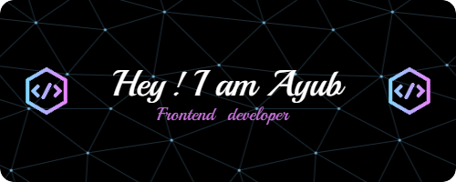

<!--Banner-->

  

<!--Night Owl image-->

  

 
 
 
 
 
 

<!--Header Name-->

_Digital Craftsman_
 

<!--Start Intro-->

I am a Frontend Developer . 

- ✨ Student of life :)
- 🌱 I’m currently learning many things, I believe that everyday is a learning opportunity.
- 💻 Visit my [Portfolio](https://mdayub-portfolio.netlify.app/) for more details about me.
<!--End Intro-->

<!--Profile Count Badge-->

  

---

<!--Languages and Tools Section-->
<h2 align="center">Tᴇᴄʜ sᴛᴀᴄᴋ</h2> 
<picture>
  <source media="(prefers-color-scheme: dark)" srcset="./Skills_Animation_Dark.gif">
  <source media="(prefers-color-scheme: light)" srcset="./Skills_Animation_White.gif">
  
</picture>
 

<h3 align="left">Current Learning</h3>
<ul align="left">
  <li>Current I learning about next js.</li>
  <li>Exploring advanced React.js .</li>
  <li>Improving my skills in other section</li>
</ul>

 
 
 
 
 
 
 
 
 
 
 
 
 
 
 
 
 

<!--Github stats Table-->
<h2 align="center">📊 Gɪᴛʜᴜʙ Sᴛᴀᴛs 📊</h2>

<table width="100%">
  <tr>
    <td width="50%">
      <h3 align="center"><strong>Gɪᴛʜᴜʙ Sᴛᴀᴛs</strong></h3>
      

        
      

    </td>
     <td width="50%">
      <h3 align="center"><strong>Sᴛʀᴇᴀᴋ Sᴛᴀᴛs</strong></h3>
      

        
      

    </td>
  </tr>
  <tr>
    <td width="50%">
      <h3 align="center"><strong>Lᴀᴛᴇsᴛ Pʀᴏᴊᴇᴄᴛ</strong></h3>
      

        
      

    </td>
    <td width="50%">
      <h3 align="center"><strong>Tᴏᴘ Cᴏɴᴛʀɪʙᴜᴛɪᴏɴs</strong></h3>
      

        
      

    </td>
  </tr>
</table>
 

---

<!--Contact Section-->

<h2 align="center">🤝 Cᴏɴɴᴇᴄᴛ Wɪᴛʜ Mᴇ 🤝 </h2>

  

 

<!--Buy me a coffee-->

<!--Footer-->

  

